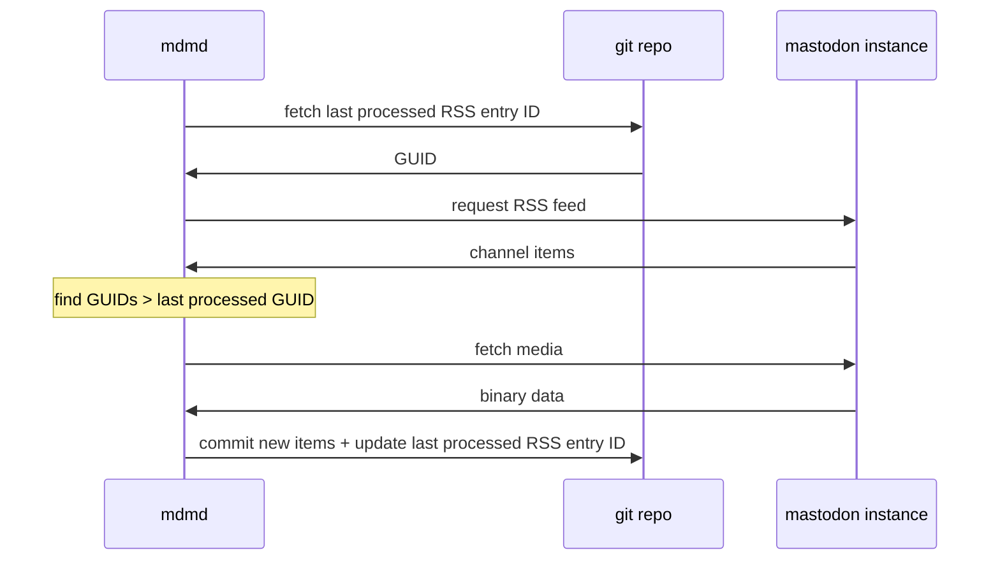

# mdmd - Mastodon RSS to Markdown files

This reads a Mastodon RSS feed, and for "new entries", writes markdown files to a Github repository.

- "New entries" are those lexically greater than a entry ID stored in Github (may be a dodgy assumption).

- The markdown format is probably specific to me, but suitable for use with [Hugo](https://gohugo.io/) and the like.

- Image and video files are also downloaded, referenced in the markdown, and added to Github.

`mdmd` produces markdown content of the form:

```
---
title: Tue 14 Mar 2023 08:23
instance: mastodon.green
toot_url: https://mastodon.green/@d6y/110020669786772308
date: 2023-03-14T08:23:12+00:00
---

<p>Things being repainted on <a href="https://mastodon.green/tags/brighton" class="mention hashtag" rel="tag">#<span>brighton</span></a> seafront this morning</p>


```

...which can render (in Hugo and similar) [like this](https://richard.dallaway.com/microposts/2023-03-14-toot-110020669786772308/).

# Development build

This is a Rust project.

You need a set of environment variables:

```
export GITHUB_TOKEN=???
export GITHUB_REPO=git_user/my_repo
export RUST_LOG=INFO,rustls=off
```

Then: `cargo run`

Or `cargo run -- -help` for more options.


# Docker build

```
docker build -t mdmd .
```

Example run:

```
docker run -it \
  -e GITHUB_TOKEN=$GITHUB_TOKEN \
  -e GITHUB_REPO=$GITHUB_REPO \
  -e RUST_LOG=$RUST_LOG \
  --rm --name running-mdmd mdmd
```


# Network back and forth


